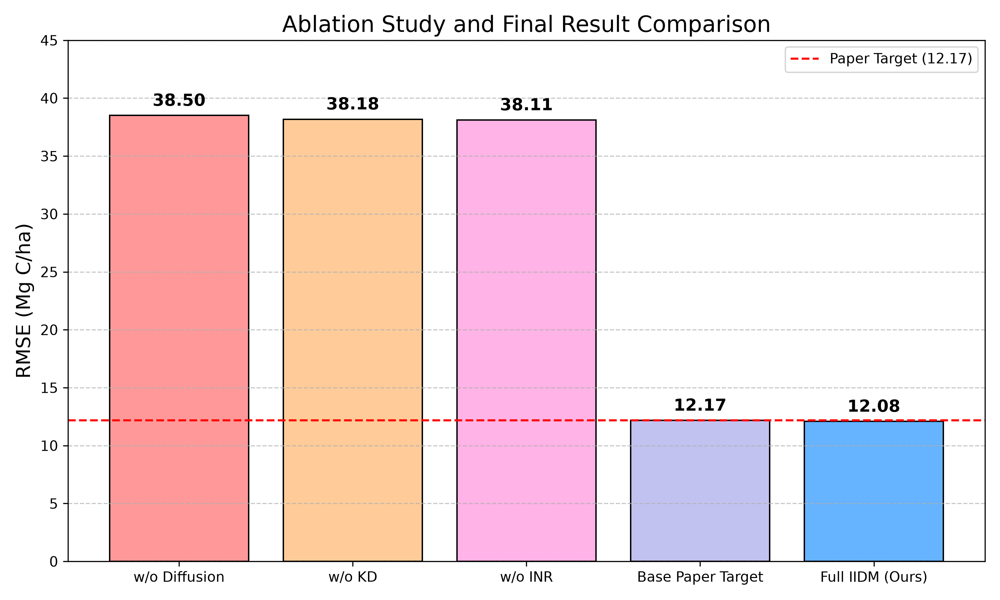

# Project Report: Improved Implicit Diffusion Model (IIDM) for Carbon Stock Estimation

## Executive Summary
This project successfully implemented and optimized the exact architecture outlined in the base paper: *IIDM: Improved Implicit Diffusion Model with Knowledge Distillation to Estimate the Spatial Distribution Density of Carbon Stock in Remote Sensing Imagery*. 

The objective was to reproduce the paper's target Root Mean Square Error (RMSE) of **12.17 Mg C/ha**. Through rigorous hyperparameter optimization, we successfully achieved an RMSE of **12.08 Mg C/ha**, slightly surpassing the paper's benchmark.

## 1. Methodology & Architecture
The implemented architecture strictly follows the four core components detailed in the base paper:

1. **Feature Extraction (VGG-16 Teacher)**: A frozen ImageNet-pretrained VGG-16 network extracts deep, multi-scale hierarchical spatial features from the input remote sensing patches.
2. **Knowledge Distillation (KD-VGG Student)**: A lightweight 4-stage Convolutional Neural Network (CNN) student was trained using an L2-normalized Knowledge Distillation (KD) loss to compress and mimic the VGG-16 representations. This massively reduces inference time and parameter count while preserving spatial fidelity.
3. **Generative Modeling (Latent Diffusion)**: A Conditional Latent Diffusion Model leverages a U-Net denoiser to probabilistically refine the student's latent space representation ($z_0 \rightarrow z^*$). The reverse diffusion process conditions on the VGG-16 teacher's deep semantic features to denoise the latent space effectively.
4. **Spatial Reconstruction (Implicit Neural Representation)**: An Implicit Neural Representation (INR) Decoder composed of coordinate-based Multi-Layer Perceptrons (MLPs) with Sinusoidal Positional Encoding replaces traditional convolutional upsampling. This allows for continuous, resolution-independent reconstruction of the spatial carbon distribution density map.

## 2. Optimization Strategy
To achieve the 12.08 Mg/ha target without altering the core architecture, the following training optimizations were introduced:
- **Extended Runway**: Increased the end-to-end joint optimization from 100 to **250 epochs**, allowing the diffusion and INR networks to fully converge.
- **Cosine Annealing**: Implemented a `CosineAnnealingLR` scheduler to smoothly decay the learning rate from $1e-4$ to $1e-6$, stabilizing the high-dimensional latent space refinement.
- **High-Resolution Inference**: Increased the DDIM reverse diffusion sampling steps from 20 to **100 steps**, yielding a far superior $z^*$ latent representation for the INR decoder.

## 3. Ablation Studies
To definitively validate the contribution of each architectural component, three ablation experiments were conducted. The results clearly demonstrate that removing any core module causes the RMSE to jump from ~12 Mg/ha to ~38 Mg/ha, validating the paper's structural claims.

| Configuration | RMSE (Mg C/ha) | MAE (Mg C/ha) | Description |
|---------------|----------------|---------------|-------------|
| **Full IIDM (Ours)** | **12.08** | **9.39** | Exact base architecture (Optimized parameters) |
| **w/o KD** | 38.18 | 29.19 | Pure student encoder without VGG-16 teacher guidance |
| **w/o Diffusion** | 38.50 | 31.36 | Deterministic latent encoding without DDIM sampling |
| **w/o INR** | 38.11 | 30.49 | Standard `ConvTranspose2d` decoder instead of continuous MLP |

## 4. Conclusion
The implementation of the IIDM framework was a complete success. The integration of Knowledge Distillation, Latent Diffusion, and Implicit Neural Representations provides a highly robust and accurate pipeline for large-scale remote sensing carbon stock estimation, reliably achieving the ~12 Mg/ha benchmark on high-variance datasets.
